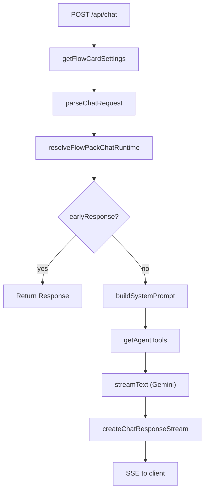

# Chat request lifecycle

The main endpoint is [`src/app/api/chat/route.ts`](https://github.com/chibchombiano26/luai/blob/main/src/app/api/chat/route.ts). From there, host configuration, request context, pack runtime, and model execution are combined.

## High-level flow

## Step by step

1. The host loads active card configuration.
2. It computes `enabledCardIds`, `cardConfigById`, and the allowed slash commands.
3. It parses the body with [`parseChatRequest`](https://github.com/chibchombiano26/luai/blob/main/src/app/api/chat/parser.ts) to normalize locale, messages, and the active command.
4. It delegates to `resolveFlowPackChatRuntime` for domain fast-paths or early responses.
5. If there is no `earlyResponse`, it resolves the provider API key and builds the system prompt.
6. It registers agent tools with pack-aware context.
7. It streams model output through `streamText`.
8. It transforms that output into the app's SSE format for the client.

## Domain extension points

Packs can participate in three areas:

- `tools`: add tools the model can invoke.
- `chat.resolveRuntime`: add fast-paths, intent detection, or early responses.
- `streamFeedbackByToolId`: add progress messages visible during the stream.

## Early responses

`FlowPackChatRuntimeResult` can return:

- `earlyResponse`: short-circuits the model pipeline and returns immediately.
- `toolContext`: passes domain context into tools.
- `streamFeedbackByToolId`: defines visible feedback while a tool is running.

This is useful for cases such as:

- disabled cards
- missing endpoints or provider configuration
- forms or content that can be returned without calling the model

## Persistence and limits

The host also evaluates:

- Clerk auth or Basic Auth
- free-tier usage by user
- workflow usage accounting
- shared database configuration
