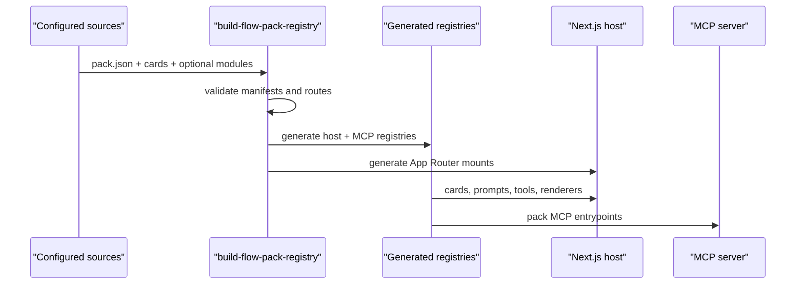

# Host and flow-pack architecture

`flow-packs` are the composition unit of the system. Each pack defines a domain contract, and the host is responsible for validating and integrating it during build.

## Build-time integration

[`scripts/build-flow-pack-registry.mjs`](https://github.com/chibchombiano26/luai/blob/main/scripts/build-flow-pack-registry.mjs) performs the integration pipeline:

1. Reads configured pack sources from local directories and installed packages.
2. Discovers packs by locating `pack.json`.
3. Validates `pack.json` and `cards/*.json` manifests.
4. Resolves optional server, UI, public page, public API, and MCP modules.
5. Generates static registries used by the host and MCP server.
6. Generates App Router mount wrappers for public pages and APIs.

This keeps the system explicit, testable, type-safe, and easier to deploy than runtime plugin loading.

## Pack sources

Pack discovery is driven by:

- `flow-packs.config.json`
- `FLOW_PACKS_DIRS`
- `FLOW_PACK_PACKAGES`

The public repository defaults to `flow-packs` and `my-flow-packs`. During local development, `npm run dev` automatically includes `private-packages` when that folder exists and no explicit source configuration has been set.

## Minimum pack contract

Every pack must include:

- `pack.json`
- `cards/`
- at least one `cards/*.json`

A pack may also contribute:

- `server/index.ts`
- `ui/index.tsx`
- `pack.json -> publicPages`
- `pack.json -> publicApiRoutes`
- `pack.json -> mcp`
- `pack.json -> admin.cardOptions`

Required card metadata includes:

- `id`
- `packId`
- `kind`
- `order`
- `category`
- `defaultEnabled`
- `toolId`
- `supportedToolIds`
- localized `name`
- localized `description`
- localized `systemPromptByLocale`
- `commands`

## Key generated files

- [`src/lib/platform/generated-flow-packs.ts`](https://github.com/chibchombiano26/luai/blob/main/src/lib/platform/generated-flow-packs.ts)
- [`src/lib/platform/generated-flow-pack-server.ts`](https://github.com/chibchombiano26/luai/blob/main/src/lib/platform/generated-flow-pack-server.ts)
- [`src/lib/platform/generated-flow-pack-ui.tsx`](https://github.com/chibchombiano26/luai/blob/main/src/lib/platform/generated-flow-pack-ui.tsx)
- [`src/mcp-server/generated-flow-pack-mcp.ts`](https://github.com/chibchombiano26/luai/blob/main/src/mcp-server/generated-flow-pack-mcp.ts)
- [`src/app/generated-flow-pack-sources.css`](https://github.com/chibchombiano26/luai/blob/main/src/app/generated-flow-pack-sources.css)

Generated public mounts are emitted under `src/app/(generated-flow-packs)`.

## Integration flow

## Public pages and API routes

If a pack declares `publicPages` or `publicApiRoutes`, the build step:

- verifies route uniqueness across packs
- validates HTTP methods for API mounts
- resolves the referenced module files
- generates mount wrappers under `src/app`

This lets packs expose public surfaces without hand-editing the host router for every pack.

## Where admin fits

The host persists platform settings and uses them to:

- enable or disable cards
- resolve `enabledCardIds`
- inject `cardConfigById`
- filter slash commands and runtime availability
- render pack-specific admin configuration

The result is that the same build can expose different active flows depending on admin state and environment configuration.

## Examples in this repository

### `weather`

- Public example pack included in the repository.
- Defines a card, backend tool, and UI renderer.
- Serves as the reference implementation for the public host contract.

### Private or packaged packs

- Can expose MCP, public pages, API routes, and admin configuration.
- Use the same host contract, whether they come from local overlays or installed packages.
