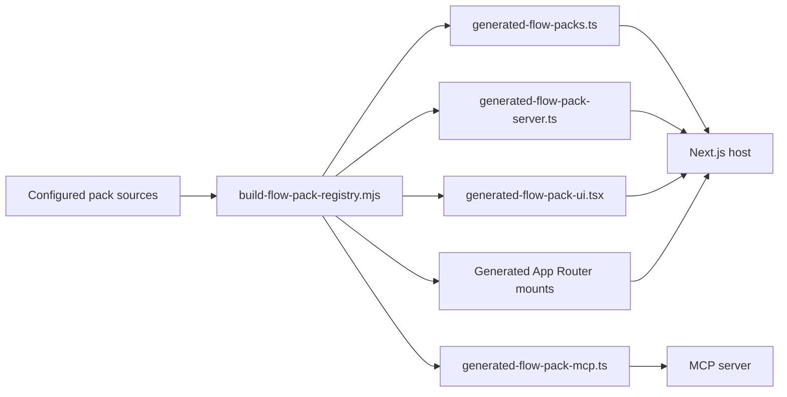

# Platform overview

`LuAI` is organized as a host platform plus build-time integrated `flow-packs`.

The two main layers are:

1. A reusable host in `src/` containing App Router pages, auth, chat runtime, admin, persistence, and shared utilities.
2. One or more `flow-packs/` that contribute cards, commands, tools, UI, public routes, and optional MCP integrations.

The main architectural choice is deliberate: packs are validated and compiled into static registries during build. The system does not rely on arbitrary runtime plugin discovery.

## Main components

- `src/app`: host pages, APIs, and generated mount wrappers.
- `src/components`: shared host UI.
- `src/hooks`: shared host hooks.
- `src/lib/platform`: pack contracts and generated registries.
- `src/lib/access`: role and group-based access resolution.
- `src/lib/chat`: slash commands and chat helpers.
- `src/lib/profile`: profile, avatar, and usage settings.
- `flow-packs/*`: isolated domain packs.
- `src/mcp-server`: MCP bootstrap generated from pack manifests.

## Mental model

## What the host owns

- Authentication and middleware behavior.
- Chat pipeline built on the `ai` SDK.
- Admin screens for card settings, AI providers, and database provider setup.
- Shared persistence and database-provider resolution.
- Tool-card rendering, chat-session state, and user profile settings.
- Coverage, testing, and deployment conventions for the reusable runtime.

## What each flow-pack owns

- Card manifests and domain contract.
- Slash commands and localized prompts.
- Backend tools and runtime-specific behavior.
- UI renderers for tool output.
- Optional public pages.
- Optional public API routes.
- Optional MCP tool module.
- Optional admin metadata for pack-specific configuration.

## Pack sources

Pack discovery is controlled by `flow-packs.config.json` plus optional environment overrides:

- `FLOW_PACKS_DIRS` for local directories
- `FLOW_PACK_PACKAGES` for installed pack packages

When `private-packages/` exists locally, `npm run dev` auto-enables it unless pack source settings were already provided explicitly.

## Public examples in this repository

- `weather`: public example pack with backend and UI integration.

Additional private or packaged packs can extend the same host contract, but they are intentionally excluded from the public documentation.
